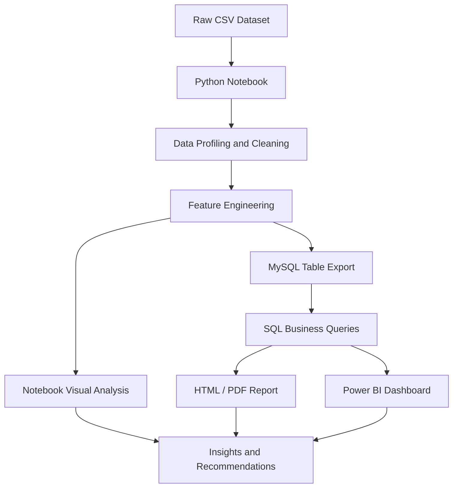

# Customer Shopping Behavior Analysis

Data-driven final year project that analyzes customer shopping patterns across gender, age, product category, shipping choice, subscription status, discount usage, and purchase frequency. The repository combines a Jupyter-based Python workflow, SQL business queries, and exported report/dashboard deliverables to present a complete retail analytics case study.

## Project Overview

This project uses a customer shopping behavior dataset with 3,900 records and 18 attributes to explore what influences revenue and customer engagement. The analysis includes data cleaning, feature engineering, SQL-based business questions, and report outputs in HTML, PDF, PPTX, and Power BI formats.

## Objectives

- Profile the shopping dataset and identify major customer and product patterns.
- Clean missing or inconsistent values to make the data analysis-ready.
- Create useful features such as age groups and purchase frequency in days.
- Answer business questions with SQL for revenue, discounts, shipping, and subscriptions.
- Present findings in a professional format suitable for academic submission and GitHub.

## Features

- Dataset profiling and quality checks.
- Missing value handling for review ratings.
- Column standardization to a consistent snake_case format.
- Feature engineering for age buckets and purchase frequency.
- SQL analysis with 10 business questions.
- Exported analysis deliverables in HTML, PDF, PPTX, and Power BI.

## Technology Stack

- Python
- Jupyter Notebook
- Pandas
- SQL
- MySQL
- SQLAlchemy
- PyMySQL
- Power BI
- CSV
- HTML, PDF, and PowerPoint exports

## Project Description

Professional version for GitHub and LinkedIn:

> Customer Shopping Behavior Analysis is a retail analytics project that examines 3,900 customer transactions to uncover revenue drivers, discount behavior, shipping preferences, subscription impact, and product performance using Python, SQL, and Power BI.

## Project Architecture / Workflow



### Workflow Details

1. Load the CSV dataset into Python.
2. Inspect structure, nulls, and summary statistics.
3. Impute missing review ratings by product category median.
4. Standardize column names for cleaner analysis.
5. Engineer age groups and purchase frequency in days.
6. Export the cleaned table to MySQL for SQL-based analysis.
7. Run business queries for revenue, discount, and customer segmentation insights.
8. Present the final story in notebook, HTML, PDF, Power BI, and presentation formats.


## Folder Structure

### Recommended GitHub Structure

```text
.
├── README.md
├── LICENSE
├── CHANGELOG.md
├── CONTRIBUTING.md
├── .gitignore
├── data/
│   └── raw/
│       └── customer_shopping_behavior.csv
├── notebooks/
│   └── Customer_Shopping_Behavior_Analysis.ipynb
├── sql/
│   └── customer_behavior_sql_queries.sql
├── dashboards/
│   └── customer_behavior_dashboard.pbix
├── reports/
│   ├── Customer_Shopping_Behavior_Analysis.html
│   ├── Customer_Shopping_Behavior_Analysis.pdf
│   └── final report.pdf
├── presentation/
│   └── final_ppt.pptx
└── assets/
    └── screenshots/
```

## Results and Insights

- The dataset contains 3,900 customer records and 18 columns.
- Only 37 review ratings were missing, and they were imputed using the median review rating for each product category.
- Revenue is concentrated in Clothing, which generated 104,264 USD, followed by Accessories at 74,200 USD.
- The customer base is skewed toward male shoppers in this dataset, with 2,652 male customers and 1,248 female customers.
- Non-subscribed customers make up the larger share of the sample, with 2,847 non-subscribers versus 1,053 subscribers.
- Average purchase amounts are relatively similar across shipping methods, ranging roughly from 58.46 USD to 60.73 USD.
- Average spending is also very close between subscription groups, suggesting subscription status alone does not strongly separate basket value in this sample.
- Top-rated products include Gloves, Sandals, Boots, Hat, and Skirt.
- Age segmentation was created with four groups, from Young Adult to Senior, to support downstream analysis.

## Future Improvements

- Replace absolute file paths with relative paths or configuration variables.
- Move credentials into a `.env` file and load them securely.
- Add a `requirements.txt` or `environment.yml` for reproducible setup.
- Add automated data validation checks before analysis runs.
- Include dashboard and report screenshots in `assets/screenshots/`.
- Add versioned release notes and publication-ready figures.
- Expand the analysis with predictive modeling or customer segmentation.

## Author Information

- Author: Mohit
- Project Type: Final Year Project
- Recommended GitHub Repository Name: `customer-shopping-behavior-analytics`
- LinkedIn Summary: Data analysis project focused on customer shopping behavior, revenue drivers, and purchase pattern insights using Python, SQL, and Power BI.

## Commit Message Suggestions

- `docs: add initial project documentation and repository structure`
- `docs: add README, license, contributing guide, and changelog`
- `chore: add gitignore for Python, Jupyter, and local environment files`
- `docs: document customer shopping behavior analysis workflow and insights`
